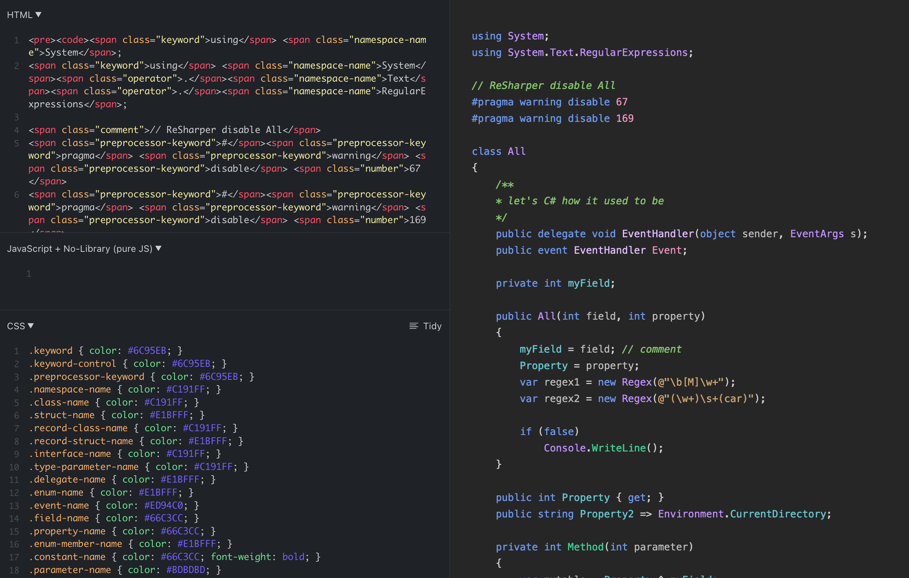

# dotnet-snippets

⚠️ This is work in progress.

This tool can be used to generate properly colored HTML snippets for C# (and presumably VB.NET) code. Given a project and a document name, it will run 
the [Roslyn classifier](https://www.strathweb.com/2020/06/c-semantic-classification-with-roslyn/) to determine the semantic type of each token in the document.

It can also transform theme files to CSS style definitions.

## 🎨 Supported Themes

- JetBrains Rider

## 📚 Related Work

- https://github.com/Swiftly1/CsharpToColouredHTML
- https://github.com/fsprojects/FSharp.Formatting

## 👏 Credits

Thanks to the helpful folks in the [C# Discord](https://discord.gg/csharp) Roslyn channel for pointing me to the [`Classifier`](https://github.com/dotnet/roslyn/blob/c9c4fd26615bb1f0ab1f9c5a679ba349005dc291/src/Workspaces/Core/Portable/Classification/Classifier.cs) class. Syntax visitors or walkers would have been way more complicated! 😅
